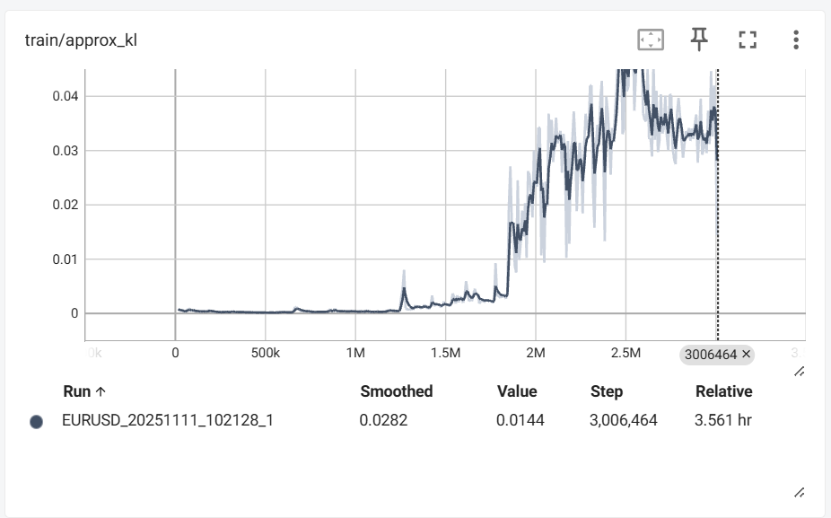

## rollout/approx_kl (Approximate Kullback-Leibler Divergence)



Approx. KL ဆိုတာက
```
"ယခင် policy (π_old) နဲ့ အသစ်ပြောင်းနေတဲ့ policy (π_new) ကြားမှာ ဘယ်လောက်ကွာသလဲ" ဆိုတာ တိုင်းတာတဲ့ metric ဖြစ်တယ်။
```

ဆိုလိုတာက — PPO ဟာ policy gradient method တစ်ခုဖြစ်တဲ့အတွက်
နဲ့ gradient step တစ်ခုပြီးတိုင်း policy distribution က ပြောင်းသွားတတ်တယ်။
အဲ့ဒါကြောင့် ပြောင်းလွန်းရင် unstable ဖြစ်နိုင်တယ်။

## Using in PPO
-   Clipping Loss မှာ policy ration (r_t) ကို clip လုပ်တဲ့အခါ KL divergence က indirect protection တစ်ခုဖြစ်တယ်
-   Monitor Metric အနေနဲ့လည်း သုံးတယ်

## Others
-   KL ကို adaptive clipping အနေနဲ့လည်း သုံးလို့ရတယ်
    KL တက်လာရင် clip_range လျော့
    KL နိမ့်နေရင် clip_range တိုး


approx_kl --> စောင့်ကြည့်ဖို့
clip_range --> တားဆီးဖို့
-   policy အသစ်နဲ့ အဟောင်း မလွန်အောင် အကန့်ထားတဲ့ control

r_t = π_new / π_old က 1.0 အတွင်း

ε = 0.2 ဆိုရင် --> r_t ကို [0.8, 1.2] ထဲမှာပဲ ခွင့်ပြုတယ်။ (1 + 0.2) and (1 - 0.2)

🧠 တစ်ခွန်းနဲ့ဆိုရင်
clip_range သည် လက်နဲ့တားတယ်။
approx_kl သည် မျက်လုံးနဲ့စောင့်တယ်။


## Adaptive Clipping Logic
KL > target_kl ရင် clip_range ကိုကျဉ်း (tighten)
KL < target_kl ရင် clip_range ကိုကျယ် (loosen)


## 0M - 1.5M 
-   ဤကာလတွင် Agent သည် စတင်သင်ယူနေဆဲဖြစ်ပြီး၊ Policy Update များသည် အလွန်သေးငယ်သည်။ Policy Network သည် သိသာသော ပြောင်းလဲမှုမရှိသေးပါ။

## 1.5M - 2.0M
-   ဤကာလအတွင်း Policy Update များ သိသိသာသာ ကြီးမားလာပြီး Policy အသစ်သည် Policy အဟောင်းမှ ခွဲထွက်သွားသည်။ ၎င်းသည် Agent သည် ပိုမိုကောင်းမွန်သော Policy (မဟာဗျူဟာ) ကြီးတစ်ခုကို ရှာဖွေတွေ့ရှိခြင်း (Rollout Reward တက်လာခြင်းနှင့် ကိုက်ညီသည်) ကို ပြသနိုင်သည်။

## 2.0M - 3.0M
-   KL တန်ဖိုးသည် PPO ၏ Target KL ($0.02$) ထက် သိသိသာသာ မြင့်မားနေသည် ကို တွေ့ရသည်။


## ဆိုးကျိုးများ
-   Target KL ကို ကျော်လွန်ခြင်း။ PPO ကို 0.02 Target KL (clip_range သည် 0.02) သတ်မှတ်ထားသော်လည်း
approx_kl သည် Target ကို များစွာ ကျော်လွန်နေပြီး 0.03 - 0.04 ၀န်ကျင်တွင်ရှိနေသည်။
ယင်းသည် policy update အလွန်ကြီးမားနေခြင်းကို ပြသသည်

-   မတည်ငြိမ်မှု (Instability): KL တန်ဖိုးသည် အလွန်အမင်း တက်လိုက်ကျလိုက်ဖြစ်နေပြီး အတက်ကျ ပြင်းထန်ခြင်းသည်
Batch Size (သို့မဟုတ်) Learning Rate ကြီးမားလွန်းခြင်းကို ညွန်ပြနေသည်။

-   Over-Clipping: KL မြင့်မားနေခြင်းသည် train/clip_fraction (0.8) မြင့်မားခြင်းနှင့်ဆက်စပ်သညါ။ KL အရမ်းကြီးလာတဲ့အခါ PPO က clip လုပ်ခြင်းကို ပိုမိုပြင်းထန်စွာလုပ်ဆောင်ပြီး Policy Update များကို ကန့်သတ်လိုက်သောကြောင့် သင်ယူမှုကို ထိရောက်မှု ကျဆင်းသွားနိုင်သည်။

## အကြံပြုချက်
Policy Update ၏ တည်ငြိမ်မှုနှင့် အရည်အသွေးကို မြှင့်တင်ရန်-
-   Learning Rate လျှော့ချကြည့်ခြင်း: 0.0001 ကို လျှော့ချကြည့်ပါ ။ ၎င်းသည် Policy Update ၏ ခြေလှမ်း အရွယ်အစားကို သေးငယ်စေပြီး KL Divergence ကို Target KL ဝန်းကျင်သို့ ပြန်ဆွဲချနိုင်သည်။

-   n_epochs တန်ဖိုးကို မြှင့်တင်ခြင်း: n_epochs (လက်ရှိ 7) ကို မြှင့်တင်ပါ (ဥပမာ: 10 သို့မဟုတ် 15)။ Rollout Data တစ်ခုတည်းကို ပိုမို ကြိမ်ရေ များများဖြင့် ထပ်ခါထပ်ခါ Update လုပ်ခြင်းသည် KL တန်ဖိုးကို လျှော့ချပြီး တည်ငြိမ်စေနိုင်သည်။