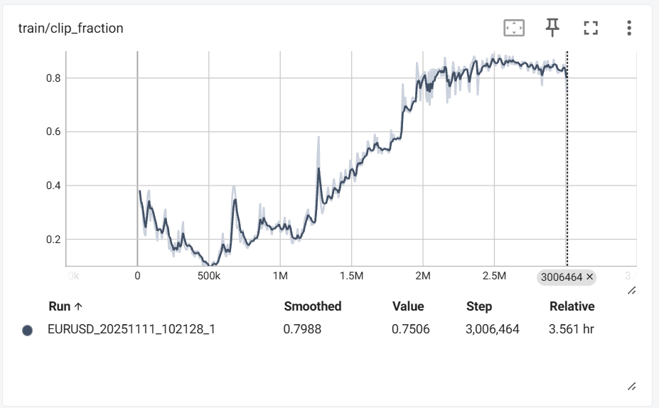

## rollout/clip_fraction (Clip fraction)

## Policy Update ဖြတ်နှုန်း
-   Policy Network Update လုပ်သောအခါ Update ကို Policy Ratio ကန့်သတ်ချက်ဖြင့်
ဖြတ်တောက် (clip) ခဲ့သည့် Data Sample (Timesteps) ရာခိုင်နှုန်းကိုပြသည်

Policy ကို Update လုပ်တဲ့ အခါ policy အဟောင်း နဲ့ အသစ်ကြား အလွန်မင်းကွာခြားခြင်းကို ကာကွယ်ရန် Policy Ratio ကို အသုံးပြုသည်။

Policy Ratio ကို clip_range (0.02) အတွင်းမှာ ထိန်းချုပ်ထားသည်။
clip_fraction မြင့်မားလေ policy update ကို ထိန်းချုပ်ရငန် ဖြတ်ထုတ်ရသည် အကြိမ်ရေ များလေဖြစ်သည်

clip_fraction မြင့်နေရင် policy update အများကြီးကို ဖြတ်ထုတ်ထားတယ်
clip_fraction နိမ့်နေရင် policy update ဖြတ်ထုတ်တာနည်းတယ်

မြန်မာလို အရိုးရိုးပြောရင်:
-   Policy update ကြီးနေ → အဟောင်းနဲ့အသစ် policy ကွာခြားမှု ကြီးတယ် → clip range ကို နည်းအောင် လျော့ → update များကို ကန့်သတ် (စစ်ထုတ်)

-   Policy update နည်းနေ → ကွာခြားမှု သေးတယ် → clip range ကို တိုး → update လုပ်ခွင့် ပေး (allow လုပ်)

တတ်နိုင်တာ = “ကြီးနေတုန်း စစ်ထုတ်၊ နည်းနေတုန်း ခွင့်ပေး” 👍