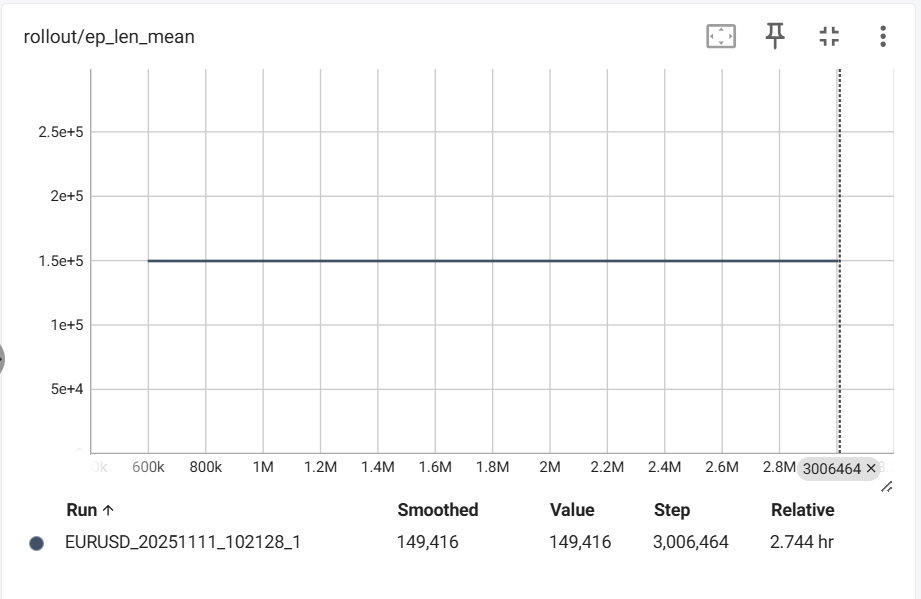

## rollout/ep_len_mean




ep_len_mean ဆိုတာ episode တစ်ခုအတွင်း ပျှမ်းမျှ step ဖြစ်ပါတယ်။  
ep_len_mean တစ်တန်းတည်း ဖြစ်နေတာဟာ episode တစ်ခုအတွင်း (Steps) အရေအတွက် တူညီနေတာကိုဆိုလိုပါတယ်။  

```
class ForexTradingEnv(gym.Env):
    def __init__():
        self.max_steps              =   len(self.data) - self.sequence_length - 1

    def step(self, action):
        # check if episode is done
        terminated          =   (self.balance <= 0)
        truncated           =   (self.current_step > self.max_steps)
```

max_steps အတိုင်း တပြည်းညီ သွားနေတဲ့ သဘောပါ။ episode တိုင်းသည် truncated ဖြစ်တယ်ဆိုတဲ့ သဘောပါ။  
terminated ဖြစ်ခဲ့ခြင်းမရှိဘူးလို့ ဆိုလိုတာပါ။ တကယ်လို့ terminated ဖြစ်ခဲ့ရင် step အရေတွက်က max_steps အောက်လျော့သွားပြီး ep_len_mean သည် တစ်တန်းတည်း မဖြစ်နိုင်တော့ပါ။
