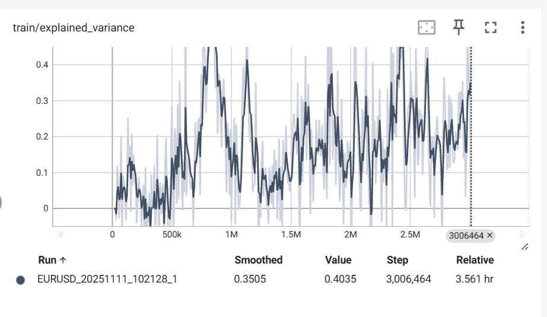

## train/explained_variance (Explained_Variance)

Explained Variance ဆိုတာ 
value function ရဲ့ prediction accuracy metric 

-   1   ->  prefect
-   0   ->  predict nothing
-   <0  ->  worse than mean prediction