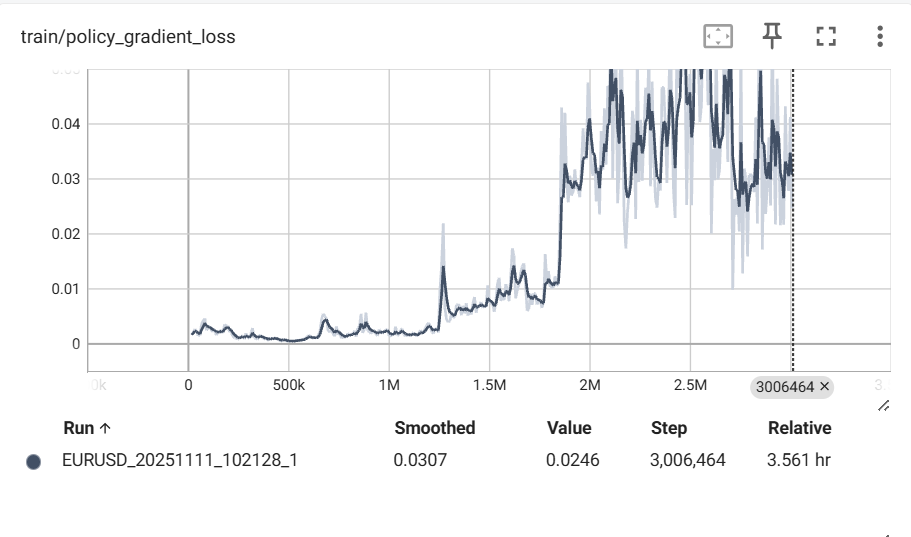
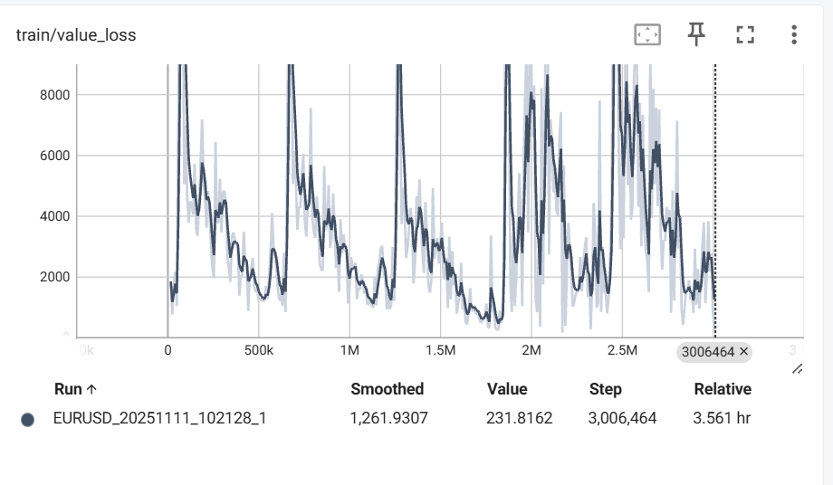
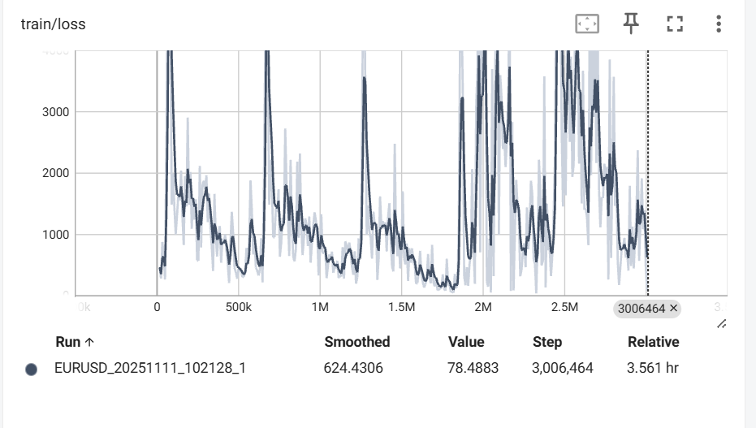

## train/policy_gradient_loss


## train/value_loss


## train/loss



### train/policy_gradient_loss
Policy Network pi ကို Update လုပ်ရန် အသုံးပြုသော Loss Function ၏ အဓိက အစိတ်အပိုင်းဖြစ်သည်။ ၎င်းကို Policy Loss ဟုလည်း ခေါ်သည်။

### train/value_loss
Value Network (Critic Network) ကို Update လုပ်ရန် အသုံးပြုသော Loss Function ဖြစ်သည်။ ၎င်းကို Value Loss ဟုလည်း ခေါ်သည်။

### train/loss
Policy Network နှင့် Value Network နှစ်ခုလုံးကို အတူတကွ Update လုပ်ရန်အတွက် အသုံးပြုသော စုစုပေါင်း Loss Function ဖြစ်သည်။

```
    တကယ်ကောင်းမွန်ပြီး တည်ငြိမ်သော Reinforcement Learning (RL) Agent ကို ရရှိရန်အတွက် Loss Functions များသည် အမြဲတမ်း တဖြောင့်တည်း ငြိမ်နေရန် မလိုအပ်သော်လည်း၊ တည်ငြိမ်သော လမ်းကြောင်း (Stable Trend) ရှိသင့်သည်။
```
